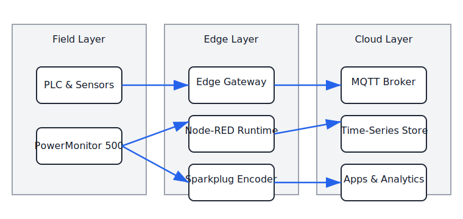

# Solution Architecture Narrative

This document explains how the PowerMonitor 500 integration concept is constructed across edge, platform, and enterprise layers. It is intended for architects and senior engineers who need to understand the decisions behind the reference implementation and the seams available for customization.

*Figure 1: The component overview highlights how field assets feed the edge gateway, which in turn packages telemetry for cloud storage and applications. Use it to identify where to extend or harden the platform.*

## Logical View

1. **Field and control layer**
   - PowerMonitor 500 meters publish real-time data via EtherNet/IP assemblies and Modbus TCP diagnostic registers.
   - PLCs or CODESYS runtimes may host supervisory logic but remain read-only participants for the integration prototype.
2. **Edge data services**
   - Node-RED flows poll EtherNet/IP assemblies in listen-only mode to avoid ownership conflicts and buffer values.
   - A transformation stage enriches raw telemetry with engineering units, asset identifiers, and quality stamps.
   - Telemetry bifurcates into MQTT Sparkplug B payloads for real-time consumers and InfluxDB line protocol for historian pers
istence.
3. **Platform and analytics**
   - InfluxDB OSS v2 captures historical metrics with retention policies tuned per site requirements.
   - Grafana dashboards visualize energy KPIs, while alert rules trigger notifications for threshold breaches.
   - Optional data egress to AWS IoT Core provides integration with enterprise analytics, billing, and data lakes.
4. **Enterprise integration**
   - AWS IoT rules forward curated payloads into Kinesis Data Streams, S3, or downstream APIs.
   - IAM policies enforce device certificate scoping, and CloudWatch metrics feed operational insights.

## Deployment View

| Layer | Workload | Packaging | High-Availability Considerations |
| --- | --- | --- | --- |
| Edge | Node-RED | Docker compose stack with environment templating | Redundant edge nodes with shared flow repository and mirrored configuration secrets. |
| Edge | Optional CODESYS orchestrator | Vendor runtime project (.project, .library) | Hot standby runtime or PLC partner for failover; CIP connection budget monitored. |
| Platform | InfluxDB OSS | Docker compose with persistent volumes | Single-node lab deployment now; roadmap includes RAFT-enabled clustered upgrade. |
| Platform | Grafana | Docker compose | LDAP-backed authentication with config-as-code JSON dashboards stored under version control. |
| Cloud | AWS IoT Core | Terraform and CloudFormation templates | Multi-AZ managed service; certificate rotation automated through IoT Jobs. |

## Data Contracts

- **MQTT Sparkplug B:** Topic namespace `spBv1.0/pm500/<site>/<area>/<asset>`. Payload includes state, metrics, and timestamps conforming to `docs/sparkplug-b.md`.
- **InfluxDB Line Protocol:** Measurement `powermonitor_500`, tags for `site`, `asset`, `phase`, and fields for kW, kWh, voltage, current, and power factor.
- **AWS IoT Payload:** JSON message using camelCase keys, enriched with site metadata, forwarded to AWS-managed targets defined in Terraform modules.

## Security Posture

- Edge nodes authenticate to InfluxDB and MQTT brokers using unique credentials stored in Docker secrets.
- TLS is enforced for MQTT when bridging to upstream brokers or AWS IoT Core.
- Principle of least privilege guides IAM roles; device certificates restricted to telemetry publish permissions.
- Audit logging is enabled for configuration changes across Node-RED, InfluxDB, and AWS IoT Core.

## Extensibility Points

- **Protocol adapters:** Additional flows can subscribe to Modbus TCP registers for diagnostics not exposed over EtherNet/IP.
- **Analytics:** Grafana dashboards accept plug-ins for anomaly detection or energy cost modeling.
- **Event routing:** AWS IoT rules can forward to Lambda for custom remediation or to ServiceNow for ticket creation.
- **Data sinks:** Replace InfluxDB with TimescaleDB or Azure Data Explorer by updating the transformation stage outputs.

## Non-Functional Requirements

| Attribute | Target | Notes |
| --- | --- | --- |
| Latency | < 2 seconds from acquisition to MQTT publish | Achieved through lean Node-RED flow design and local buffering. |
| Availability | 99.5% edge uptime | Requires redundant hardware or virtualization hosts; Node-RED flows stored in Git for rapid restore. |
| Scalability | 50 meters per site | Connection budget monitored; aggregator nodes may be added for load distribution. |
| Security | CIS Level 1 hardening on edge hosts | Includes disabling unused services, enforcing MFA on management consoles, and regular patching. |
| Observability | Full telemetry coverage with metrics, logs, and traces | Compose stack integrates Telegraf exporters and central log shipping. |

## Implementation Status

- Edge and historian reference components are live in lab environments.
- Cloud integration scaffolding is available but pending production IAM review.
- Operational hardening and automated failover remain future work per the roadmap.

