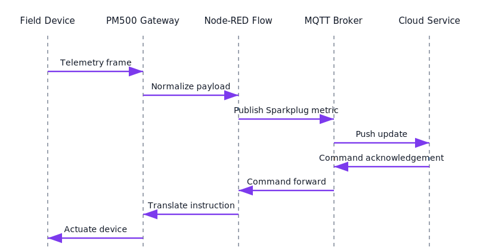

# Device Interface Overview

Understand the PowerMonitor 500 assemblies and communication modes before onboarding the edge stack.

## Available Data Points
- **Assemblies**
  - Real-time measurement Assembly 100 (used by Node-RED sample flows)
  - Input Assembly 101
  - Output Assembly 102
  - Configuration Assembly 107
- **Heartbeat**
  - Producer heartbeat instance 98
  - Consumer heartbeat instance 99
- **Attributes**
  - Attribute 3 is exposed for read/write access where supported

## Supported Transport Modes
- **Implicit Messaging** for real-time cyclic data exchange.
- **UCMM Explicit Messaging** for on-demand parameter access and configuration.

*Figure 1: The integration sequence clarifies the telemetry and command loop so interface designers know where timing and protocol translations occur.*

## Configuration Restrictions
- All write operations must be performed via **Modbus TCP**.
- Only a single Modbus TCP socket may be open at any given time.
- Modbus connectivity is mutually exclusive with EtherNet/IP operation; enable only one protocol at a time.
- When operating in EtherNet/IP Listen-Only mode, periodic keep-alive traffic is required to maintain the connection.

## Related Repository Assets
- Node-RED assembly polling examples in [`src/node-red/flows/`](../../src/node-red/flows/) read Assembly 100 Attribute 3 using listen-only EtherNet/IP connections that honor the constraints outlined above.
- Polling guardrails in [`advanced_usage.md`](advanced_usage.md) expand on connection ownership and interval recommendations referenced in this overview.
- Recovery procedures in [`../troubleshooting/recovery.md`](../troubleshooting/recovery.md) include heartbeat monitoring routines tailored to the assemblies described here.
